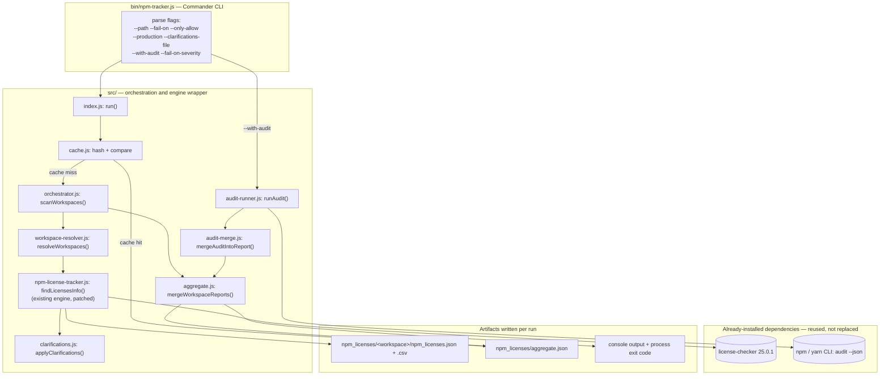
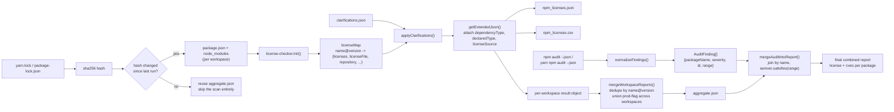
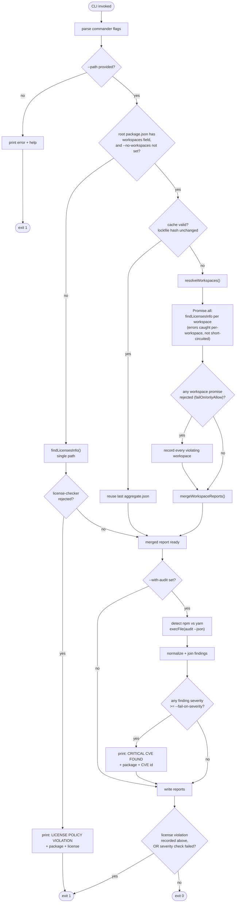

# npm-license-tracker — Detailed Implementation Plan for Missing Features

Companion to [`2026-09-gpl-cve-compliance-license-tracker.md`](./2026-09-gpl-cve-compliance-license-tracker.md). That doc covers the business problem and the strategic shape. This doc is the engineering design: exact files, exact functions, exact wiring, for every missing feature, grounded in the actual current source of [amittkSharma/npm-license-tracker](https://github.com/amittkSharma/npm-license-tracker) (read directly from `master`, not guessed).

---

## 0. Baseline — what the code actually does today

Repo layout:
```
bin/npm-tracker.js       CLI entry (commander)
src/index.js             run() → startLicenseTracking()
src/npm-license-tracker.js   the real engine — wraps `license-checker`
src/exceptions.js        3 string-template error messages
package.json             deps: license-checker 25.0.1, commander 13.1.0,
                          json2csv 5.0.7, fs-extra 11.3.0, colors 1.4.0,
                          read-package-json 7.0.1
```

**The single most important fact for this whole plan:** `npm-license-tracker` already depends on `license-checker@25.0.1` (the real, mature davglass package) and calls `licenseChecker.init(options, callback)` directly. `license-checker` **already implements** SPDX validation + license-text fallback guessing, `failOn`, `onlyAllow`, `production`/`development` filters, `exclude`, `excludePackages`, `excludePrivatePackages`, `onlyunknown`, `summary`, `customPath`. None of that is a gap in the dependency — it's a gap in **what npm-license-tracker exposes**. Concretely, in `src/npm-license-tracker.js`:

```js
var options = {
  json: true,
  start: "",
  customFormat: format,
};
...
options.start = path;   // the ONLY field ever mutated
```

Everything else `license-checker` supports is simply never set. So most of "Stories 0–3" below are **plumbing work**, not algorithm work — this changes effort estimates a lot versus assuming SPDX parsing has to be written from scratch.

### 0.1 Feature origin map — what's ported from `license-checker-rseidelsohn`, what's already upstream, what's net-new

Every feature in this plan traces to exactly one of three origins. Nothing below is invented without saying so:

| Feature | Origin | Evidence |
|---|---|---|
| SPDX validation + LICENSE-file guessing (`*` marking) | **Already in upstream `license-checker@25.0.1`**, already installed | Confirmed by reading `license-checker`'s own README — no port needed, just stop discarding it |
| `--fail-on` / `--only-allow` | **Already in upstream `license-checker`** as `failOn`/`onlyAllow` options | Same flag names, same semantics — this package just never wired its CLI to them |
| `--production` / `--development` | **Already in upstream `license-checker`** | Same |
| `--exclude-licenses`, `--exclude-packages`, `--exclude-private-packages`, `--only-unknown`, `--summary` | **Already in upstream `license-checker`** as `exclude`, `excludePackages`, `excludePrivatePackages`, `onlyunknown`, `summary` | Same — Story 3's only real work is the flag-name translation layer (see naming trap note) and the `--summary` output-shape branch |
| **Clarifications file** (`--clarifications-file`) | **Ported from `license-checker-rseidelsohn`** (`--clarificationsFile`) | Upstream `license-checker` does **not** have this; the rseidelsohn fork does. This is the one feature in Stories 0–3 that is a genuine port, not a pass-through, because the underlying dependency this package uses doesn't have it — see Story 1 |
| **Monorepo/workspace-aware scanning** | **Net-new — exists in neither tool** | Confirmed against both `license-checker`'s and `license-checker-rseidelsohn`'s docs; this is Story 4, and it's the actual differentiator the strategy doc called for |
| **CVE cross-reference (`--with-audit`)** | **Net-new — exists in neither tool** | Both license tools are explicitly license-only by design; Story 5 integrates an external scanner (`npm audit`/`yarn npm audit`) rather than porting anything |

So: the plan **does** incorporate the other package's enhancements (clarifications file is a direct port; the naming-parity table in Story 3 makes sure the rest of rseidelsohn's flag surface is at least reachable even though the underlying mechanism was already present via upstream `license-checker`) — and it goes beyond rseidelsohn for the two things neither tool solves, which happen to be exactly the two things this monorepo actually needs (workspace correctness, CVE data).

### 0.2 Problem-statement traceability — does this actually solve "no GPL, no critical CVEs in production"?

Restating the regulatory requirement: **companies in regulated German markets (Automotive, Finance) must not ship packages with GPL-family licenses or unpatched critical CVEs into production.** Mapping each clause to the story that closes it:

| Requirement clause | Closed by | End-state CI invocation |
|---|---|---|
| "must not ship GPL-family licenses" | Story 0 (`--fail-on`) + Story 1 (clarifications file for false positives) | `npm-tracker --path . --production --fail-on "GPL-2.0;GPL-3.0;AGPL-3.0" --clarifications-file ./license-clarifications.json` |
| "...into **production**" (not dev tooling) | Story 2 (`--production`) | same invocation — `--production` is what scopes the gate away from eslint/jest/etc. |
| "...across the whole monorepo, not just one package" | Story 4 (workspace-aware aggregation, union-not-intersection prod attribution) | orchestrator auto-detects `workspaces` in root `package.json` and runs the above per workspace, failing if **any** workspace violates |
| "must not ship critical CVEs" | Story 5 (`--with-audit --fail-on-severity critical`) | `npm-tracker --path . --with-audit --fail-on-severity critical` (one call at repo root — see Story 5's monorepo-asymmetry note, no per-workspace audit needed) |
| "auditable / provable to a regulator" | Existing `npm_licenses/` JSON+CSV output (already built) + Story 4's `aggregate.json` + Story 1's `licenseSource: clarified/detected` field + Story 5's per-package `cves[]` array | archive all of the above as CI pipeline artifacts per PR/build |

Combined end-to-end CI step once every story lands:
```bash
npm-tracker --path . \
  --production \
  --fail-on "GPL-2.0;GPL-3.0;AGPL-3.0" \
  --clarifications-file ./license-clarifications.json \
  --with-audit --fail-on-severity critical
```
Single command, single exit code, two independently-labeled failure reasons in the console output (per Story 5's exit-code-separation decision), full evidence trail archived. That is the literal, complete answer to the problem statement — everything in Stories 0–5 exists to make this one command both possible and correct.

### 0.3 Technical stack

Every entry below is either already installed (reused as-is, per the ponytail ladder — don't replace what already works), a Node.js built-in (zero new dependency), or a deliberate, justified new addition. No entry is speculative.

| Layer | Technology | Version / API | Already installed? | Source | Why this, not an alternative |
|---|---|---|---|---|---|
| Runtime | Node.js | ≥22.x | n/a (host runtime) | https://nodejs.org/api/ | Matches the consuming monorepo's own `.tool-versions` pin (`nodejs 22.22.1`) — no cross-version surprises when this tool runs inside that CI |
| Language | JavaScript (CommonJS) | — | ✅ existing style throughout `src/`, `bin/` | — | Existing codebase is plain JS/CJS; introducing TypeScript or ESM would be an unrequested rewrite of working code — out of scope |
| CLI parsing | `commander` | 13.1.0 | ✅ | https://github.com/tj/commander.js | Already the CLI framework; new flags are additive `.option()` calls, nothing to swap |
| File I/O | `fs-extra` | 11.3.0 | ✅ | https://github.com/jprichardson/node-fs-extra | Already used for JSON read/write and file copy; clarifications-file loading reuses `readJsonSync` |
| CSV output | `json2csv` | 5.0.7 | ✅ | https://github.com/juanjoDiaz/json2csv | Already wired for the existing CSV export path |
| Terminal styling | `colors` | 1.4.0 | ✅ (pinned) | https://github.com/Marak/colors.js | **Flag, don't silently trust:** this package had a real supply-chain sabotage incident in Jan 2022 (versions `1.4.1`/`1.4.44-liberty-2` were corrupted by the maintainer). Version `1.4.0`, which is what's pinned here, predates the incident and is safe — but pin the exact version (already done) and don't let a future `npm update` drift past it unreviewed. Longer-term, `picocolors` (zero-dependency, actively maintained) is a lower-risk alternative worth a swap, tracked as a separate follow-up, not bundled into this plan |
| **License scanning engine** | `license-checker` | 25.0.1 | ✅ | https://github.com/davglass/license-checker | This is the actual engine doing SPDX validation, `failOn`/`onlyAllow`, `production`/`development`, `exclude*`, `summary` — already installed, just not exposed (see §0.1) |
| SPDX expression evaluation | `spdx-expression-parse`, `spdx-satisfies`, `spdx-correct`, `spdx-license-ids` | (transitive) | ✅ transitively, via `license-checker` | https://github.com/jslicense/spdx-expression-parse.js | Pulled in by `license-checker` itself — no direct dependency needed; this is *where* `"MIT OR GPL-3.0"`-style expressions actually get resolved |
| Clarifications-file pattern (design reference only) | `license-checker-rseidelsohn` | — | ❌ not installed, not depended on | https://github.com/RSeidelsohn/license-checker-rseidelsohn | Source of the **concept** (Story 1) — ported as new code against our own `license-checker`-based engine, not pulled in as a second scanning dependency (would be redundant with what's already installed) |
| Workspace glob resolution | `node:fs` `globSync` | Node 22 built-in (experimental flag) | ✅ built-in | https://nodejs.org/api/fs.html#fsglobsyncpattern-options | Zero new dependency; **caveat:** marked experimental as of Node 22 — pin a fallback (`fast-glob`, ~0 transitive weight) behind a `try/catch` capability check in case the experimental API is removed/changed before this ships |
| Cache-key hashing | `node:crypto` `createHash('sha256')` | built-in | ✅ built-in | https://nodejs.org/api/crypto.html | Standard library covers this completely; no hashing package needed |
| Shelling out to package-manager audit | `node:child_process` `execFile` | built-in | ✅ built-in | https://nodejs.org/api/child_process.html#child_processexecfilefile-args-options-callback | `execFile` (array args, no shell) specifically — chosen over `exec`/`spawn` with `shell: true` to eliminate command-injection risk from user-supplied `--path` |
| Test harness | `node:test` + `node:assert` | Node 22 built-in | ✅ built-in | https://nodejs.org/api/test.html | Package currently has **no test runner at all** (bug #7); built-in test runner avoids adding Jest/Mocha/Vitest as a dependency for a CLI tool this size |
| CVE data source (primary) | `npm audit` / `yarn npm audit` CLI | already-installed package managers | ✅ (shells out, not a dependency) | https://docs.npmjs.com/cli/v10/commands/npm-audit | Zero integration cost — both package managers already exist wherever this tool runs; underlying advisory data ultimately comes from the https://github.com/advisories (GitHub Advisory Database) |
| CVE data source (fallback/vendor-neutral) | OSV.dev API | REST, no auth required | ❌ not integrated by default | https://osv.dev/docs/ | Documented as the fallback if `npm audit`/`yarn npm audit` prove unreliable or rate-limited in CI — not built into Story 5's first cut, since that would be solving a problem that hasn't been observed yet |
| Version-range matching for CVE join | `semver` | latest stable | ⚠️ verify transitive presence before adding explicitly | https://github.com/npm/node-semver | The **only** net-new production dependency this entire plan may need — used once, to check if a package's resolved version falls inside an advisory's vulnerable range |
| CI/CD target (consuming repo) | Azure Pipelines | — | ✅ already in use | https://learn.microsoft.com/en-us/azure/devops/pipelines/ | Matches `.azuredevops/*.yml` already present in this monorepo — the enhanced CLI is wired in as a pipeline task, not a new CI system |
| Release automation | `commit-and-tag-version` | 12.7.3 | ✅ existing devDependency | https://github.com/absolute-version/commit-and-tag-version | Already the package's own release flow (`npm run release`); the `v4.0.0` breaking bump (Story 0) rides the existing mechanism |

### 0.4 Architecture, data flow, and control flow

Three diagrams, each answering a different question. All three describe the **same system** at increasing levels of behavioral detail — component boundaries, then what data moves where, then what decisions the code actually makes at runtime.

#### Architecture diagram — component boundaries and ownership



**Ownership boundary, stated explicitly:** everything left of the `Deps` subgraph is new/modified code from this plan. Everything inside `Deps` is a black box this plan deliberately does not reimplement — `license-checker` for license detection, the host's own package manager for vulnerability data. This is the architectural expression of the "don't build a CVE database, don't rewrite SPDX parsing" decisions made in Stories 0 and 5.

#### Data flow diagram — what data exists at each stage, and its shape



**Key data-shape transition to notice:** the join in `mergeAuditIntoReport()` is by package **name**, then filtered by `semver.satisfies()` against the resolved version — not a direct `name@version` key match — because advisory data is expressed as a vulnerable version *range*, while the license report has an exact resolved version. Getting this join key wrong (using `name@version` directly against advisory data) would silently produce zero matches.

#### Control flow diagram — the actual runtime decision tree, including every exit path



**What this diagram makes explicit that prose alone would hide:** there are exactly two independent failure sources (license gate, CVE severity gate) that both terminate at the same `exit 1`, but each prints a distinguishable, differently-labeled message before doing so — this is the concrete runtime implementation of the exit-code-separation decision made in Story 5. There is also exactly one caching short-circuit (`CACHE` → `REUSE`) and it only applies to the workspace path, never to a single-package scan, since a single-package scan is already cheap enough not to need one.

### Bugs found in the current code that block correct CI gating (fix these first, before Story 0)

| # | File | Bug | Why it matters |
|---|---|---|---|
| 1 | `src/npm-license-tracker.js` | `options` and `format` are **module-level singletons**, mutated per call (`options.start = path`) | Race condition the moment two scans run concurrently in the same process — which Story 4 (monorepo, one scan per workspace) will do |
| 2 | `src/npm-license-tracker.js` → `licenseFinder` | `reject("error occured in reading npm packages", err)` — `Promise.reject` only takes **one** argument; `err` is silently discarded | The actual `license-checker` error (which is what `failOn`/`onlyAllow` violations surface as) never reaches the caller |
| 3 | `src/npm-license-tracker.js` → `findLicensesInfo` | The whole `.then().then().then()` chain has **no `.catch()`** and the function **doesn't `return` the promise** | Any rejection becomes an unhandled promise rejection — Node logs a warning but the process can still exit 0 |
| 4 | `src/index.js` → `run` | `startLicenseTracking` calls `licenseFinder.findLicensesInfo(path)` and returns nothing; `run()` doesn't await or return it either | Even if bugs #2/#3 were fixed, `run()` swallows the result completely |
| 5 | `bin/npm-tracker.js` | `process.on('uncaughtException', ...)` only **logs**, never calls `process.exit(1)`; there is no `.catch()` on `npmTracker.run(...)` at all | Confirms: **today, this tool cannot fail a CI build under any circumstance.** This is the actual, literal blocker — not hypothetical |
| 6 | `src/npm-license-tracker.js` → `getDependencies` | Computes `type: "dependency" \| "devDependency"` per package, but `getExtendedJson` **never reads that field** — only uses the `packages` array to compute `immediate` vs `transitive` | The prod/dev information is already extracted and then thrown away |
| 7 | `package.json` | `"test": "echo \"Error: no test specified\" && exit 1"` | No test harness exists at all — must be established as part of Story 0, not assumed |

None of these are edge cases — #5 alone means the tool is currently **structurally incapable of gating a pipeline**, regardless of which flags get added. Fixing #1–#5 is Story 0's real content.

---

## Story 0 — Make the tool able to fail a build at all (`--fail-on`, `--only-allow`)

### Goal
`npm-tracker --path . --fail-on "GPL-2.0;GPL-3.0;AGPL-3.0" ` exits with code `1` and a non-zero-exit-causing message when any resolved dependency license matches. `--only-allow "MIT;Apache-2.0;BSD-3-Clause;ISC"` exits `1` if any dependency's license is **not** in the list.

### Architecture
```
bin/npm-tracker.js  (commander flags: --fail-on, --only-allow)
        │  opts.failOn / opts.onlyAllow (raw strings, semicolon-separated
        │  — this is license-checker's own expected format, don't reformat it)
        ▼
src/index.js  run(params)
        │  MUST become: `return startLicenseTracking(params)`
        │  and `startLicenseTracking` MUST return the promise from
        │  `licenseFinder.findLicensesInfo(params)`
        ▼
src/npm-license-tracker.js  findLicensesInfo(parameter)
        │  builds a FRESH options object per call (fixes bug #1)
        │  passes failOn/onlyAllow straight into the license-checker options
        │  returns the full promise chain with a terminal .catch that
        │  re-throws (fixes bugs #2, #3)
        ▼
licenseChecker.init(options, cb)   [already installed — zero new deps]
        │  license-checker itself detects the violation and calls
        │  cb(err) where err is a descriptive string/Error
        ▼
bin/npm-tracker.js: npmTracker.run(...).catch(err => {
  console.error(err);
  process.exit(1);          // <-- the actual missing line in today's code
});
```

### Exact code changes

**`src/npm-license-tracker.js`** — stop mutating shared state, thread new options through, fix rejection:

```js
// BEFORE (module-level, mutated per call — race condition + swallowed errors)
var options = { json: true, start: "", customFormat: format };

licenseFinder = function (path) {
  const p = new Promise((resolve, reject) => {
    licenseChecker.init(options, (err, licenseMap) => {
      if (err) {
        reject("error occured in reading npm packages", err);  // bug #2
      }
      resolve(licenseMap);
    });
  });
  return p;
};

// AFTER
licenseFinder = function (path, gateOptions = {}) {
  const options = {
    json: true,
    start: path,
    customFormat: format,
    ...(gateOptions.failOn ? { failOn: gateOptions.failOn } : {}),
    ...(gateOptions.onlyAllow ? { onlyAllow: gateOptions.onlyAllow } : {}),
  };
  return new Promise((resolve, reject) => {
    licenseChecker.init(options, (err, licenseMap) => {
      if (err) {
        reject(err);   // pass the real error object through, unmodified
        return;         // don't fall through to resolve() after reject()
      }
      resolve(licenseMap);
    });
  });
};
```

```js
// module.exports.findLicensesInfo — BEFORE: fire-and-forget, no return, no catch
module.exports = {
  findLicensesInfo: function (parameter) {
    var path = parameter.path;
    var isExcelNeeded = parameter.isExcel;
    options.start = path;
    readModulePackageJson(path).then((packages) => {
      licenseFinder(path).then((result) => {
        writeJsonFile(path, result, packages, isExcelNeeded).then((x) => {
          console.log("JSON file is created".green);
          copyLicenseFiles(x.destinationFolder, x.updatedResult);
        });
      });
    });
  },
};

// AFTER: return the chain, propagate gate options, single terminal catch
module.exports = {
  findLicensesInfo: function (parameter) {
    const { path, isExcel: isExcelNeeded, failOn, onlyAllow } = parameter;
    return readModulePackageJson(path)
      .then((packages) =>
        licenseFinder(path, { failOn, onlyAllow }).then((result) =>
          writeJsonFile(path, result, packages, isExcelNeeded).then((x) => {
            console.log("JSON file is created".green);
            copyLicenseFiles(x.destinationFolder, x.updatedResult);
            return x;
          })
        )
      );
      // NOTE: deliberately no .catch() here — let the rejection propagate
      // to src/index.js so the CLI is the single place that decides what
      // "failure" means (console output + exit code), per the ponytail
      // principle of one error-handling seam, not one per layer.
  },
};
```

**`src/index.js`** — return the promise instead of discarding it:

```js
// BEFORE
function startLicenseTracking(path, isProduction) {
  licenseFinder.findLicensesInfo(path)
}
module.exports = {
  run: function(params) {
    if (params == "" || params == null) {
      console.error(`${exceptions.NoProperArguments(_noPathProvided)}`);
    } else {
      console.info(`Paths to traverse:- ${params.path}`);
      startLicenseTracking(params, true);
    }
  }
}

// AFTER
function startLicenseTracking(params) {
  return licenseFinder.findLicensesInfo(params);
}
module.exports = {
  run: function(params) {
    if (params == "" || params == null) {
      console.error(`${exceptions.NoProperArguments(_noPathProvided)}`);
      return Promise.reject(new Error(_noPathProvided));
    }
    console.info(`Paths to traverse:- ${params.path}`);
    return startLicenseTracking(params);
  }
}
```

**`bin/npm-tracker.js`** — add flags, and (this is the actual fix for bug #5) **exit non-zero on rejection**:

```js
program
  .option('--path <path>', '[required] Path to package json for package under consideration')
  .option('--isExcel', '[optional] To generate excel workbook on the results of npm license tracker')
  .option('--fail-on <licenses>', '[optional] semicolon-separated SPDX ids; exit 1 if any dependency license matches')
  .option('--only-allow <licenses>', '[optional] semicolon-separated SPDX ids; exit 1 if any dependency license is NOT in this list')
  ...

var npmTracker = require('../src/index.js');
npmTracker.run({
  path: options.path,
  isExcel: options.isExcel || false,
  failOn: options.failOn,
  onlyAllow: options.onlyAllow,
}).catch((err) => {
  console.error('npm-license-tracker failed:', err.message || err);
  process.exit(1);
});
```

### Edge cases
- **Both flags passed together** — `license-checker` ANDs them (must satisfy allow-list *and* not hit fail-on); no special handling needed, just pass both through untouched.
- **Empty-string flag** (`--fail-on ""`) — commander will set it to `""`, which is falsy, so the spread guards (`gateOptions.failOn ? ... : {}`) correctly no-op it. Verify with a test, don't assume.
- **Compound SPDX expressions** (`"MIT OR GPL-3.0"`) — `license-checker` itself claims SPDX-expression-aware matching for `failOn`/`onlyAllow`. This needs an explicit test fixture, not just trust in the README, since expression-boundary behavior (does `failOn: "GPL-3.0"` correctly flag a package licensed `"MIT OR GPL-3.0"`, and should it — arguably that package is *legally* fine to use under MIT) is exactly the kind of subtlety that silently breaks compliance guarantees if assumed rather than verified.

### Test plan (also establishes the test harness — none exists today, bug #7)
- Add `"test": "node --test test/"` to `package.json` using Node's built-in `node:test` (Node 22+ is already the org's baseline per `.tool-versions` in the consuming monorepo — **zero new dependency**, ladder rung 3).
- `test/fixtures/gpl-fixture/` — a minimal `package.json` + a hand-crafted `node_modules/fake-gpl-pkg/package.json` with `"license": "GPL-3.0"`.
- `test/fixtures/clean-fixture/` — same shape, MIT-only.
- Tests:
  1. `findLicensesInfo({path: gplFixture, failOn: 'GPL-3.0'})` → promise rejects.
  2. `findLicensesInfo({path: cleanFixture, failOn: 'GPL-3.0'})` → promise resolves.
  3. `findLicensesInfo({path: cleanFixture, onlyAllow: 'MIT'})` → resolves.
  4. `findLicensesInfo({path: gplFixture, onlyAllow: 'MIT'})` → rejects.
  5. CLI-level: spawn `bin/npm-tracker.js` as a child process against the GPL fixture, assert `exitCode === 1`.

---

## Story 1 — Accurate detection surfacing + clarifications file

### What's already free
`license-checker` already does SPDX validation with LICENSE-file-text fallback guessing, and already marks guessed licenses with a trailing `*` in the `licenses` string it returns. Because `getExtendedJson` copies `info.licenses` through unmodified, **the `*` marker already survives into npm-license-tracker's JSON/CSV today** — this is not a gap. Confirmed by reading `getExtendedJson`: no field is dropped or rewritten for the `licenses` value itself.

### What's actually missing
1. No pass-through for `unknown` / `onlyunknown` (license-checker options that filter the report to guessed-only) — pure plumbing, same pattern as Story 0.
2. **Clarifications file** — this does **not** exist in upstream `license-checker` at all (it's a feature specific to the `license-checker-rseidelsohn` fork, which this package does not depend on). This is genuinely new code.

### Architecture
```
--clarifications-file <path>.json
        │
        ▼
loadClarifications(path) → { "pkgName@version": { licenses: "MIT", reason: "..." } }
        │
        ▼
licenseChecker.init(...) → licenseMap   (unchanged)
        │
        ▼
applyClarifications(licenseMap, clarifications)   ← NEW pure function
        for each key present in BOTH licenseMap and clarifications:
          licenseMap[key].licenses = clarifications[key].licenses
          licenseMap[key]._clarified = true
        for each key in clarifications NOT present in licenseMap:
          console.warn(`clarification for ${key} is stale — package no longer resolved`)
        │
        ▼
getExtendedJson(...)  ← modify to also emit `"licenseSource": info._clarified ? "clarified" : "detected"`
```

### Clarifications file format (new, define explicitly — this is a compliance artifact, its schema is a decision, not an implementation detail)
```json
{
  "some-pkg@1.2.3": {
    "licenses": "MIT",
    "reason": "package.json license field is wrong; verified against LICENSE file and vendor confirmation on 2026-09-01",
    "approvedBy": "legal-team-email@company.com"
  }
}
```

### Exact code changes
- New file `src/clarifications.js`:
```js
const fs = require('fs-extra');

function loadClarifications(filePath) {
  if (!filePath) return {};
  return fs.readJsonSync(filePath); // fail loudly on malformed JSON — fail-closed
}

function applyClarifications(licenseMap, clarifications) {
  const result = { ...licenseMap };
  for (const key of Object.keys(clarifications)) {
    if (result[key]) {
      result[key] = { ...result[key], licenses: clarifications[key].licenses, _clarified: true };
    } else {
      console.warn(`[npm-license-tracker] clarification for "${key}" is stale — package not found in current dependency tree`);
    }
  }
  return result;
}

module.exports = { loadClarifications, applyClarifications };
```
- `src/npm-license-tracker.js`: after `licenseFinder(...)` resolves and before `writeJsonFile(...)`, insert `result = applyClarifications(result, loadClarifications(parameter.clarificationsFile))`.
- `getExtendedJson`: add `"licenseSource": info._clarified ? "clarified" : "detected"` to the returned object per package.
- `bin/npm-tracker.js`: add `--clarifications-file <path>` and `--only-unknown` flags, wire straight through (same pattern as Story 0).

### Edge cases
- Malformed JSON in the clarifications file → let it throw (don't catch-and-ignore) — a broken compliance override file is worse to silently ignore than to hard-fail the build.
- Clarification references a package **not** in the current tree (dependency removed/upgraded since the override was written) → warn only, don't fail — a stale entry isn't a policy violation, it's tech debt in the override file itself.
- `--only-allow`/`--fail-on` gating runs on the **already-clarified** license value, so a legitimate manual override correctly un-blocks a false-positive GPL detection — verify this ordering explicitly in a test (clarify-then-gate, not gate-then-clarify).

### Test plan
- Fixture package with an intentionally wrong `"license": "GPL-3.0"` field; clarifications file remaps it to `MIT`; assert `failOn: "GPL-3.0"` no longer rejects.
- Fixture with a clarification entry for a package name/version not present; assert a `console.warn` is emitted and the run still succeeds.

---

## Story 2 — Production vs. development separation

### What's already free
`license-checker` already resolves the **correct transitive production-only subgraph** when given `options.production = true` (or `development = true`) — it does this via real dependency-graph walking, not string matching on `package.json`. This is important: don't reinvent transitive prod/dev attribution by hand (that was the original plan's naive idea) — the dependency already does it correctly, including for transitive packages, which `npm-license-tracker`'s own `getDependencies`/`getExtendedJson` code does **not** currently do (it only labels *immediate* deps as `dependency`/`devDependency`, per bug #6, and doesn't even output that field).

### Architecture
```
--production   → options.production = true   (license-checker gates the WHOLE
--development  → options.development = true    resolution, not a post-filter)
```
This is the cheapest story in the whole plan: it's a 2-line pass-through, because the hard part (transitive-aware prod/dev resolution) is already solved by the dependency you already have installed.

### Exact code changes
- `src/npm-license-tracker.js`, `licenseFinder`: add `...(gateOptions.production ? { production: true } : {})`, same for `development`.
- Also **fix bug #6** as part of this story since it's the same code path: in `getExtendedJson`, stop discarding the `type` field —
```js
dependencyType:
  packages.filter((pkg) => pkg.label === x).length > 0 ? "immediate" : "transitive",
declaredType:
  (packages.find((pkg) => pkg.label === x) || {}).type || _noInfoFound,
```
This gives immediate deps a real `dependency`/`devDependency` label in the report (informational only — the actual prod/dev **gating** decision is made by license-checker's `production`/`development` option above, not by this field; don't conflate the two).

### Edge case that must be flagged, not silently handled
- **Monorepo workspaces**: `production`/`development` resolution is relative to whichever `package.json` license-checker is pointed at (`options.start`). In a single-package repo this is exactly right. In a workspace repo, a dependency might be `dependencies` in one workspace and `devDependencies` in another, and hoisting puts one physical copy in the root `node_modules`. **This story alone does not solve that** — it only works correctly when Story 4 calls it once per workspace and then applies "gate if production in ANY workspace" union logic at merge time (see Story 4). Document this explicitly so nobody ships Story 2 standalone in this monorepo and assumes it's fully correct.

### Test plan
- Fixture with one prod dep (MIT) and one dev-only dep (GPL-3.0); `{production: true, failOn: 'GPL-3.0'}` → resolves (dev dep excluded from the scan entirely, not just from the gate). `{development: true, failOn: 'GPL-3.0'}` on the same fixture → rejects.

---

## Story 3 — Filtering & report ergonomics

### What's already free
All of `exclude`, `excludePackages`, `excludePrivatePackages`, `onlyunknown`, `summary` are existing `license-checker` options. Pure plumbing, identical pattern to Stories 0/2 — add CLI flags, spread into the per-call options object.

**Naming trap to avoid:** upstream `license-checker`'s flag is `exclude` (a comma-separated license list), not `excludeLicenses`. `excludeLicenses`/`includeLicenses` are `license-checker-rseidelsohn`-fork-only naming. If this package's own CLI surface uses `--exclude-licenses` for ergonomics/consistency with the rest of its own flag names, that's fine — just make sure the **internal mapping** is `gateOptions.excludeLicenses → options.exclude` and this translation is written down in one place (a small const map), not reimplemented ad hoc at each call site.

### One real shape hazard: `--summary`
`license-checker`'s `summary: true` mode changes the **shape** of what the callback receives (a license-name → count map, not a package map). `writeJsonFile`/`getExtendedJson`/`generateCsvFile` all currently assume a package-keyed map (`Object.keys(json).map(...)`, `info.repository`, etc.) — passing `summary: true` through today would silently crash or produce garbage on those field accesses. This must branch explicitly:
```js
if (gateOptions.summary) {
  return writeSummaryFile(path, result); // new function, new (simpler) output shape
}
return writeJsonFile(path, result, packages, isExcelNeeded); // existing path, unchanged
```
Do not attempt to force summary output through the existing per-package formatter.

### Test plan
- `--exclude-licenses "GPL-3.0"` fixture → GPL package present in `node_modules` is simply absent from the resulting report (not just unflagged).
- `--summary` → assert output shape is `{ "MIT": 12, "GPL-3.0": 1 }`-style counts, and that this does NOT crash `getExtendedJson` (i.e., confirms the branch above is actually taken).

---

## Story 4 — Monorepo / workspace awareness (net-new, biggest lift)

Neither `license-checker` nor `license-checker-rseidelsohn` handle this — it is the genuine differentiator, and it is where actual new algorithmic work (not plumbing) is required.

### Architecture
```
bin/npm-tracker.js
   auto-detects: does root package.json have a `workspaces` field?
      yes → orchestrateWorkspaceScan(rootPath, gateOptions)
      no  → existing single-path findLicensesInfo(rootPath, gateOptions)   [unchanged]
   opt-out flag: --no-workspaces  (force single-root scan even if workspaces exist,
                 useful for local debugging / faster iteration)

src/workspace-resolver.js  (NEW)
   resolveWorkspaces(rootPath) -> string[] absolute workspace directories
      - read root package.json `workspaces` (array of globs)
      - expand globs to real directories using Node 22's built-in
        fs.globSync (zero new dependency — ladder rung 3/5: stdlib/
        already-available runtime feature beats adding `fast-glob`)
      - filter out any resolved dir that has no package.json (template
        scaffolding dirs, empty placeholders) — log at debug level, don't warn

src/orchestrator.js  (NEW)
   async function scanWorkspaces(rootPath, gateOptions):
     1. const workspaceDirs = resolveWorkspaces(rootPath)
     2. const results = await Promise.all(
          workspaceDirs.map(dir =>
            findLicensesInfo({ path: dir, ...gateOptions })
              .then(r => ({ workspace: dir, ok: true, result: r }))
              .catch(err => ({ workspace: dir, ok: false, error: err }))
          )
        )
        // NOTE: catch per-workspace, don't let Promise.all short-circuit —
        // we need to know EVERY violating workspace, not just the first
     3. const merged = mergeWorkspaceReports(results)      // src/aggregate.js
     4. writeAggregateReport(rootPath, merged)
     5. const violations = results.filter(r => !r.ok)
        if (violations.length) {
          console.error(`License/CVE policy violated in ${violations.length} workspace(s):`);
          violations.forEach(v => console.error(`  - ${v.workspace}: ${v.error.message || v.error}`));
          throw new Error('workspace scan failed'); // propagates to bin script's .catch → exit(1)
        }
        return merged;

src/aggregate.js  (NEW)
   mergeWorkspaceReports(results) -> aggregateReport
      - dedupe identical "name@version" keys across workspaces (same physical
        hoisted node_modules entry) into ONE row
      - track `referencedBy: string[]` (which workspaces use it)
      - track `productionInAnyWorkspace: boolean` — union, not intersection:
        if package X is a `devDependency` in workspace A but a `dependency`
        in workspace B, it ships to production via B, so it must be gated
        as production for the WHOLE repo even though A alone would exempt it
```

### Why "union, not intersection" is the correct policy (write this down, it's a judgment call not an implementation detail)
The compliance question is "does this GPL package ever reach a production build artifact anywhere in this monorepo?" — not "does it reach production in every workspace that happens to use it." A single workspace shipping it in production is enough to trigger the block. Getting this backwards (intersection) would silently under-report risk.

### Concurrency risk to verify, not assume
Running `license-checker.init()` in parallel across workspaces (`Promise.all`) is only safe if `license-checker` itself holds no hidden module-level mutable state (separate from the bug already fixed in Story 0 within *this* package's own code). Spike this with a 2-workspace fixture before committing to parallel execution in the real implementation; fall back to sequential (`for...of` with `await`) with a per-workspace progress log if anything looks flaky. Don't assume a third-party dependency is reentrant just because ours now is.

### Output layout
```
npm_licenses/
  <workspace-name-1>/npm_licenses.json   (existing per-workspace format, unchanged)
  <workspace-name-2>/npm_licenses.json
  aggregate.json                          (NEW — merged, deduped, cross-workspace view)
```

### Performance / caching (this is the concrete implementation of the "re-scan is slow" blocker raised in the strategy doc)
- New file `src/cache.js`: compute a hash of `yarn.lock` (or `package-lock.json`) + every workspace `package.json` (`crypto.createHash('sha256')`, Node built-in — zero new dependency).
- Compare against a stored hash in `.npm-license-tracker-cache.json` (gitignored) at the start of `scanWorkspaces`.
- If unchanged, skip the scan and reuse the last aggregate report, printing `"No dependency changes since last scan — using cached report"`.
- CI wiring note: this cache file should NOT be committed or restored from a shared CI cache across branches without care — a cache hit that's stale relative to a lockfile change on a *different* branch would produce a false pass. Key the CI cache restore on the lockfile hash itself, not just "restore if present."

### Edge cases
- Glob matches a directory with no `package.json` → skip, debug-log only, not a warning (this is normal for template/scaffolding directories).
- Internal cross-workspace dependencies declared as `workspace:*` (Yarn) or `workspace:^` → these aren't third-party packages; exclude them from the license report entirely (no public license applies to your own code) — detect via the version string prefix `workspace:` in each workspace's own `package.json` before even reaching `license-checker`.
- Deeply nested template workspaces used to scaffold *new* projects (e.g. a `scripts/templates/projects/*` glob) should be scanned like any other workspace — a template's own dependencies still get installed if someone runs it, so its licenses matter too; don't special-case template dirs out unless a workspace pattern deliberately excludes them.

### Test plan
- 2-workspace fixture: workspace A has GPL pkg as `devDependency` only, workspace B has the *same* GPL pkg as a `dependency`. With `--production --fail-on GPL-3.0`: assert the aggregate scan **fails**, proving the union-not-intersection logic (a naive per-workspace-only check with A scanned alone would pass).
- Dedup test: same MIT package present in both workspaces → assert `aggregate.json` contains exactly one row for it, with `referencedBy: [A, B]`.
- Cache test: run scan twice with no lockfile change → assert second run logs the "cached" message and does not re-invoke `license-checker.init`.

---

## Story 5 (stretch) — CVE cross-reference

Explicitly **not** core license-tracker functionality — this is an integration point to an existing scanner, not a new vulnerability database. Reinventing CVE data is the one thing this plan actively avoids building.

### Architecture
```
--with-audit                    (new flag, opt-in — off by default, since it
                                  requires network egress the license scan
                                  itself doesn't need)
--fail-on-severity <level>       critical | high | moderate | low

src/audit-runner.js  (NEW)
   detectPackageManager(path) -> 'yarn' | 'npm'
     (presence of yarn.lock + .yarnrc.yml → yarn; else npm)

   runAudit(path) -> Promise<AuditFinding[]>
     - use child_process.execFile (NOT exec, NOT string interpolation into
       a shell) — `path` ultimately originates from CLI input, so building
       a shell command string from it is a command-injection risk even in
       a local dev tool
     - yarn:  execFile('yarn', ['npm', 'audit', '--json'], { cwd: path })
       → output is NDJSON (one JSON object per line) in Yarn Berry, NOT a
         single JSON blob like classic npm audit — parse line-by-line
     - npm:   execFile('npm', ['audit', '--json'], { cwd: path })
       → single JSON blob, different schema than yarn's

   normalizeFindings(rawOutput, manager) -> AuditFinding[]
     AuditFinding = { packageName, severity, id, url, vulnerableRange }
     (a small adapter per manager — this is the only place format
      differences are allowed to leak into)

src/audit-merge.js  (NEW)
   mergeAuditIntoReport(licenseReport, findings) -> combined report
     - join key is package NAME, not name@version — audit advisories are
       expressed as vulnerable version RANGES, not exact resolved versions
     - for each licenseReport row, check if its resolved version satisfies
       any finding's vulnerableRange (use `semver.satisfies`, which is
       already a transitive dependency of nearly everything in this
       ecosystem — confirm before adding it explicitly; if not already
       present, it's a 0-dependency-tree, extremely stable stdlib-adjacent
       package, acceptable to add)
     - attach `cves: AuditFinding[]` array to the matching row
     - rows with no matching finding get `cves: []`
```

### Exit-code separation (a decision, not a detail)
License policy violations and CVE severity violations must produce **visibly distinguishable** failure output even though both currently collapse to process exit code `1`:
```
LICENSE POLICY VIOLATION: package "gpl-lib@2.0.0" is licensed GPL-3.0 (deny-listed)
CRITICAL CVE FOUND: package "lodash@4.17.15" has CVE-2021-23337 (severity: critical)
```
Reason: these route to different owners (Legal vs. Security) for triage — a merged, undifferentiated "build failed" message forces someone to go dig through the JSON report to find out which team even owns the fix.

### Edge cases
- **Network egress required.** `npm audit`/`yarn npm audit` call the public advisory API by default. CI runners with restricted egress need `registry.npmjs.org` (and whatever advisory endpoint the package manager uses) allow-listed — this is an infra prerequisite to flag to whoever owns CI network policy, not something code can work around.
- **Monorepo asymmetry** — unlike the license scan, a single root `yarn.lock` covers the whole workspace tree in one audit call. Do **not** build per-workspace audit plumbing to mirror Story 4 — that would be wasted, duplicated network calls for identical data. One call at the repo root is correct and sufficient.
- **Yarn Berry NDJSON vs. classic npm's single blob** — this is a real parsing risk specific to this consuming monorepo (which uses Yarn 4 per its `.yarnrc.yml`/`.tool-versions`) — must be covered by an actual fixture-based test, not inferred from documentation, since audit output formats have changed across tool versions before.
- **`execFile` argument array, never a shell string** — non-negotiable; `path` is attacker-influenceable input in principle (anyone who can invoke the CLI with a crafted `--path`), so it must never be concatenated into a shell command.

### Test plan
- Mock `child_process.execFile` in tests (don't hit the real network in CI for this package's own test suite) with a canned Yarn NDJSON fixture and a canned classic-npm JSON fixture; assert `normalizeFindings` produces identical shape from both.
- `mergeAuditIntoReport` test: a package resolved at `4.17.15` with a finding whose vulnerable range is `<4.17.21` → attached; a package at `4.17.21` against the same finding → not attached (verifies `semver.satisfies` boundary, not just presence/absence of package name).
- `--fail-on-severity critical` with a mocked "high" severity only finding → does NOT fail; with a mocked "critical" finding → fails, with the "CRITICAL CVE FOUND" message format from above.

---

## New dependencies required, story by story

| Story | New runtime dependency? |
|---|---|
| 0 (exit codes) | None — `license-checker` already installed |
| 1 (clarifications) | None — uses `fs-extra`, already installed |
| 2 (prod/dev) | None |
| 3 (filtering/summary) | None |
| 4 (monorepo) | None — Node 22 built-in `fs.globSync` + built-in `crypto` for cache hashing |
| 5 (CVE) | `semver` only if not already transitively present (verify with `npm ls semver` before adding explicitly) — everything else uses Node's built-in `child_process` |

This plan adds **zero new production dependencies** across five of six stories, and at most one (`semver`) for the stretch story — deliberately, since every one of these problems is solvable with what's already installed or what the runtime already provides.

---

## Suggested sequencing

1. **Prerequisite fixes** (bugs #1–#7) — must land first; nothing else is testable or safe without them.
2. **Story 0** — the tool literally cannot gate a build without this; ship as `v4.0.0` (breaking: `findLicensesInfo`'s internal promise behavior changes from silent to rejecting).
3. **Story 2** — cheapest remaining story (2-line pass-through), immediately useful standalone for non-monorepo consumers.
4. **Story 1 and Story 3** — can proceed in parallel, no shared files touched.
5. **Story 4** — depends on Stories 0–2 being stable (it calls `findLicensesInfo` per workspace and needs its gating/prod-dev behavior to already be correct).
6. **Story 5** — fully independent of 1–4; can be built in parallel by a second contributor at any point, merged last since it's explicitly a stretch goal.

## Definition of done (whole plan)

- [ ] `bin/npm-tracker.js` exits `1` on a GPL fixture with `--fail-on`, exits `0` on a clean one.
- [ ] `--production` excludes a dev-only dependency from the scanned set entirely (not just from the gate).
- [ ] A clarifications-file override changes gating outcome for a misdetected package.
- [ ] `--summary` does not crash the JSON/CSV writers.
- [ ] Workspace scan correctly fails when a denied license is production-only in one workspace among several (union logic proven, not assumed).
- [ ] Cached re-run (no lockfile change) skips the actual scan.
- [ ] `--with-audit --fail-on-severity critical` fails on a mocked critical CVE and passes on a mocked low one, with distinguishable console output from a license-policy failure.
- [ ] Full `node --test` suite green; no test hits the real network or the real npm/yarn advisory API.
